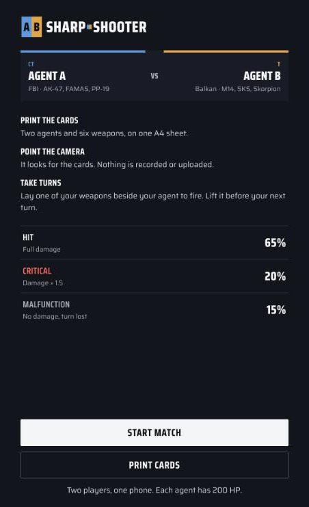

<h1>
  <picture>
    <source media="(prefers-color-scheme: dark)" srcset="assets/logo-inverse.svg">
    
  </picture>
</h1>

**Live: [sharpshooter.thitichotk.com](https://sharpshooter.thitichotk.com)** (on a phone, over HTTPS)

Sharp-Shooter is a turn-based shooter played with printed cards and a phone camera. Two agents face each other on the
table; lay a weapon card beside yours and your agent fires at the other one. The screen reads like an esports
broadcast: a scorebug at the top, a kill feed for every shot, and a lower third that says whose turn it is.



## How to play

1. **Print the cards.** Open [the card sheet](https://sharpshooter.thitichotk.com/cards) and print it on A4 at 100%
   scale, then cut along the dashed lines. You get two agents and six weapons.
2. **Start a match** and allow the camera. It only looks for the cards; nothing is recorded or uploaded.
3. **Show both agent cards.** A 3D agent stands on each one, and they turn to face each other.
4. **Take turns.** On your turn, lay one of your weapons beside your agent to fire. Lift it off the table before your
   next turn, so a card left lying there can't keep firing.
5. The first agent to reach 0 HP loses. **Rematch** starts over without reloading.

| Agent A (CT, FBI) | Damage | Agent B (T, Balkan) | Damage |
|---|---:|---|---:|
| AK-47 | 28 | M14 | 27 |
| FAMAS F1 | 22 | SKS Type 56 | 24 |
| PP-19 Bizon | 15 | Vz. 61 Skorpion | 14 |

Each agent has 200 HP. Every shot is a **hit** (65%), a **critical** for 1.5× damage, rounded (20%), or a
**malfunction** that does nothing and still uses the turn (15%).

Tips:

- Use matte paper and even light; glossy cards reflect into the camera.
- Keep the cards flat and fully in view. The agent cards need to be visible for a shot to count.
- If the camera doesn't start, allow it for the site in the browser settings and close other apps using it.

## Run it locally

A static site with no build step. The camera needs HTTPS or `localhost`.

```bash
git clone https://github.com/thitichotk/sharp-shooter.git
cd sharp-shooter
python3 -m http.server 8000      # open http://localhost:8000 (a laptop webcam works)
node --test                      # the game rules
```

To try it on a phone before pushing, put the local server behind an HTTPS tunnel (for example
`cloudflared tunnel --url http://localhost:8000`).

Cloudflare Pages deploys `main` as it is, and each pull request gets its own HTTPS preview link, which is the easiest
way to try a change on a phone.

## How it works

| Path | Role |
|---|---|
| `index.html` | The A-Frame scene (8 MindAR targets, agents, guns, effects) and the HUD and menu screens |
| `game.js` | Card tracking, the frame loop, scorebug, kill feed, lower third, card locks, screens |
| `state.js` | The rules: turns, re-arming, odds, damage, game over. No A-Frame, so `node --test` can check it |
| `state.test.js` | Tests for `state.js` |
| `cards.html` | The printable A4 card sheet |
| `styles.css` | The Sharp-Shooter design system: plates, CT blue and T gold, Saira Condensed |
| `mind/targets.mind` | MindAR's compiled image targets, in the order agent A, agent B, AK-47, FAMAS, PP-19, M14, SKS, Skorpion |
| `model/`, `plane/` | 3D models and card art |

Built with [A-Frame](https://aframe.io/) 1.6, [MindAR](https://hiukim.github.io/mind-ar-js-doc/) 1.2.5 and
[A-Frame Extras](https://github.com/c-frame/aframe-extras) 7.4, all loaded with subresource integrity. The agent and
explosion models were compressed with `gltf-transform optimize` (quantized meshes, WebP textures), which took the
download from 48 MB to 9 MB.

## Credits and licence

The 3D models are from Sketchfab and keep their own licences:

| Model | Author | Licence |
|---|---|---|
| [FBI, CS2 Agent Model No.3](https://sketchfab.com/3d-models/fbi-cs2-agent-model-no3-fa50dee1de004abd80b4577dffd4e5c1) | [6lucius](https://sketchfab.com/6lucius) | CC BY 4.0 |
| [Balkan, CS2 Agent Model Dragomir No.1](https://sketchfab.com/3d-models/balkan-cs2-agent-model-dragomir-no1-23068c01997140519f9832e8bbcd97d4) | [6lucius](https://sketchfab.com/6lucius) | CC BY 4.0 |
| [AK-47 (Blockbench)](https://sketchfab.com/3d-models/ak-47-blockbench-563f179882d84bd795ea5ce299536228) | [GGlecoco](https://sketchfab.com/gglecocoyt) | CC BY-NC 4.0 |
| [Famas F1 (Blockbench)](https://sketchfab.com/3d-models/famas-f1-blockbench-1089f5f1cbbf411ba5e470702fb2e5c7) | [GGlecoco](https://sketchfab.com/gglecocoyt) | CC BY 4.0 |
| [PP-19 Bizon](https://sketchfab.com/3d-models/pp-19-bizon-50f51a786b0946eb893b4108c55874ab) | [GGlecoco](https://sketchfab.com/gglecocoyt) | CC BY 4.0 |
| [M14](https://sketchfab.com/3d-models/m14-73b82540c05449ebbae289d4a079979e) | [GGlecoco](https://sketchfab.com/gglecocoyt) | CC BY 4.0 |
| [Type 56 SKS (Blockbench)](https://sketchfab.com/3d-models/type-56-sks-blockbench-fb528727dade441c950f0bd1c79af904) | [GGlecoco](https://sketchfab.com/gglecocoyt) | CC BY 4.0 |
| [VZ.61 Skorpion](https://sketchfab.com/3d-models/vz61-skorpion-08eaf3d208e249e1879ac792128e3aac) | [GGlecoco](https://sketchfab.com/gglecocoyt) | CC BY 4.0 |
| [Timeframe Explosion](https://sketchfab.com/3d-models/timeframe-explosion-9e73437350dc4bcab9b2f3a4a044b16e) | [Jorma Rysky](https://sketchfab.com/Rysky) | CC BY 4.0 |

The code is [MIT](LICENSE) © 2024–2026 Thitichot K. The models and card art are covered by the licences above, and the
AK-47 model's licence is non-commercial.

The agent models and card art depict characters from Counter-Strike 2, which belong to Valve. This is a non-commercial
fan project, not affiliated with or endorsed by Valve.
